# RAG Chat Application

A modern **Retrieval-Augmented Generation (RAG)** chat application built with Next.js and Couchbase, enabling intelligent conversations powered by vector search and OpenAI's language models.

   

## 🚀 Overview

This RAG Chat Application combines the power of large language models with your own data through vector search capabilities. Users can upload documents (PDFs, text files, web URLs) and have intelligent conversations about the content, making it perfect for document analysis, knowledge management, and AI-powered research assistance.

## ✨ Key Features

- **🤖 Intelligent Chat Interface**: Natural language conversations with AI
- **📄 Document Upload**: Support for PDF files, text documents, and web URLs
- **🔍 Vector Search**: Semantic search through uploaded documents using embeddings
- **💾 Persistent Storage**: Documents and embeddings stored in Couchbase
- **⚡ Real-time Responses**: Streaming chat responses for better user experience
- **🎨 Modern UI**: Clean, responsive interface built with Tailwind CSS
- **📱 Mobile Friendly**: Fully responsive design for all devices

## 🛠️ Tech Stack

### Frontend
- **[Next.js 14](https://nextjs.org/)** - React framework with App Router
- **[React 18](https://react.dev/)** - UI library with hooks and modern features
- **[TypeScript](https://www.typescriptlang.org/)** - Type-safe JavaScript
- **[Tailwind CSS](https://tailwindcss.com/)** - Utility-first CSS framework
- **[Lucide React](https://lucide.dev/)** - Beautiful icons
- **[React Markdown](https://github.com/remarkjs/react-markdown)** - Markdown rendering
- **[React Dropzone](https://react-dropzone.js.org/)** - File upload component

### Backend
- **[Node.js](https://nodejs.org/)** - JavaScript runtime
- **[Express.js](https://expressjs.com/)** - Web application framework
- **[Couchbase](https://www.couchbase.com/)** - NoSQL database with vector search
- **[OpenAI API](https://openai.com/api/)** - GPT models and embeddings
- **[Multer](https://github.com/expressjs/multer)** - File upload middleware
- **[PDF Parse](https://www.npmjs.com/package/pdf-parse)** - PDF text extraction
- **[Cheerio](https://cheerio.js.org/)** - Web scraping for URL content

### Development Tools
- **[Nodemon](https://nodemon.io/)** - Development server auto-restart
- **[ESLint](https://eslint.org/)** - Code linting
- **[PostCSS](https://postcss.org/)** - CSS processing
- **[Autoprefixer](https://autoprefixer.github.io/)** - CSS vendor prefixes

## 🏗️ Architecture

### System Overview

```
┌─────────────────┐    ┌─────────────────┐    ┌─────────────────┐
│   Frontend      │    │   Backend       │    │   Database      │
│   (Next.js)     │◄──►│   (Express)     │◄──►│   (Couchbase)   │
│                 │    │                 │    │                 │
│ • Chat UI       │    │ • REST API      │    │ • Documents     │
│ • File Upload   │    │ • File Processing│   │ • Embeddings    │
│ • Responsive    │    │ • Vector Search │    │ • Vector Index  │
└─────────────────┘    └─────────────────┘    └─────────────────┘
                                │
                                ▼
                       ┌─────────────────┐
                       │   OpenAI API    │
                       │                 │
                       │ • GPT Models    │
                       │ • Embeddings    │
                       └─────────────────┘
```

### RAG Pipeline: Text-to-Embeddings-to-Response Flow

The following diagram illustrates the complete journey of how English text gets converted to embeddings, processed through the RAG system, and returned as contextually aware responses:

```mermaid
graph TD
    A["👤 User Input<br/>(English Text)"] --> B["🔄 Text Preprocessing<br/>• Tokenization<br/>• Cleaning<br/>• Chunking"]
    
    B --> C["🤖 OpenAI Embedding API<br/>text-embedding-ada-002<br/>1536 dimensions"]
    
    C --> D["📊 Query Vector<br/>(Numerical Embeddings)"]
    
    D --> E["🔍 Couchbase Vector Search<br/>• Cosine Similarity<br/>• K-Nearest Neighbors<br/>• Semantic Matching"]
    
    E --> F["📚 Document Store<br/>Couchbase Database<br/>• Documents<br/>• Pre-computed Embeddings<br/>• Metadata"]
    
    F --> G["📄 Retrieved Documents<br/>• Relevant Chunks<br/>• Similarity Scores<br/>• Context Window"]
    
    G --> H["🧠 Context Assembly<br/>• Combine Query + Documents<br/>• Format for LLM<br/>• Add Instructions"]
    
    H --> I["🚀 OpenAI GPT API<br/>GPT-4 / GPT-3.5-turbo<br/>• Context Understanding<br/>• Response Generation"]
    
    I --> J["📝 Generated Response<br/>(English Text)<br/>• Contextually Aware<br/>• Source-grounded"]
    
    J --> K["👤 User Receives Answer<br/>(English Text)"]
    
    %% Document Ingestion Flow
    L["📄 Document Upload<br/>PDF, Text, URL"] --> M["🔧 Content Extraction<br/>• PDF Parse<br/>• Web Scraping<br/>• Text Processing"]
    
    M --> N["✂️ Text Chunking<br/>• Split into segments<br/>• Overlap handling<br/>• Size optimization"]
    
    N --> O["🤖 Generate Embeddings<br/>OpenAI API<br/>text-embedding-ada-002"]
    
    O --> P["💾 Store in Couchbase<br/>• Document chunks<br/>• Vector embeddings<br/>• Metadata indexing"]
    
    P --> F
    
    %% Styling
    classDef userInput fill:#e1f5fe,stroke:#01579b,stroke-width:2px
    classDef processing fill:#f3e5f5,stroke:#4a148c,stroke-width:2px
    classDef embedding fill:#fff3e0,stroke:#e65100,stroke-width:2px
    classDef database fill:#e8f5e8,stroke:#1b5e20,stroke-width:2px
    classDef llm fill:#fce4ec,stroke:#880e4f,stroke-width:2px
    classDef output fill:#e0f2f1,stroke:#004d40,stroke-width:2px
    
    class A,K userInput
    class B,H,M,N processing
    class C,D,O embedding
    class E,F,P database
    class I llm
    class G,J output
```



### 🔄 Detailed Process Flow

#### **1. Query Processing Pipeline**
1. **User Input** → English text question or query
2. **Text Preprocessing** → Clean and prepare text for embedding
3. **Embedding Generation** → Convert to 1536-dimensional vector using OpenAI
4. **Vector Search** → Find semantically similar documents in Couchbase
5. **Context Retrieval** → Get relevant document chunks with similarity scores
6. **Context Assembly** → Combine query with retrieved context
7. **LLM Processing** → Generate contextually aware response using GPT
8. **Response Delivery** → Return English text answer to user

#### **2. Document Ingestion Pipeline**
1. **Document Upload** → PDF, text files, or web URLs
2. **Content Extraction** → Parse and extract text content
3. **Text Chunking** → Split into manageable segments with overlap
4. **Embedding Generation** → Create vector representations
5. **Database Storage** → Store documents and embeddings in Couchbase

#### **3. Key Technical Components**

- **Embedding Model**: `text-embedding-ada-002` (1536 dimensions)
- **Vector Search**: Cosine similarity with configurable K-nearest neighbors
- **LLM Models**: GPT-4 or GPT-3.5-turbo for response generation
- **Database**: Couchbase with vector indexing capabilities
- **Chunking Strategy**: Overlapping text segments for context preservation

## 🎯 Use Cases

### 📚 Document Analysis & Research
- Upload research papers, reports, or documentation
- Ask questions about specific content and get contextual answers
- Extract insights and summaries from large documents

### 💼 Business Intelligence
- Upload company documents, policies, or procedures
- Enable employees to quickly find information through natural language queries
- Create an intelligent knowledge base for customer support

### 🎓 Educational Support
- Upload textbooks, lecture notes, or study materials
- Get explanations, summaries, and answers to study questions
- Create personalized learning experiences

### 📖 Content Management
- Organize and search through large document collections
- Enable semantic search across multiple file types
- Build intelligent content recommendation systems

## 🚀 Quick Start

### Prerequisites

- **Node.js** (v18 or higher)
- **Couchbase Server** (v7.0 or higher)
- **OpenAI API Key** (with credits)

### 1. Clone the Repository

```bash
git clone <repository-url>
cd RAG-app
```

### 2. Install Dependencies

```bash
# Install frontend dependencies
npm install

# Install backend dependencies
cd server
npm install
cd ..
```

### 3. Setup Couchbase

1. **Install Couchbase Server**: Download from [couchbase.com](https://www.couchbase.com/downloads)
2. **Create Cluster**: Set up a new cluster with default settings
3. **Load Sample Data**: Import the `travel-sample` bucket
4. **Create Vector Index**: Follow the [Couchbase Vector Search Guide](https://www.couchbase.com/blog/guide-to-data-prep-for-rag/)

### 4. Configure Environment

```bash
# Copy environment template
cp server/env.example server/.env

# Edit the .env file with your settings
```

**Required Environment Variables:**
```env
# Couchbase Configuration
COUCHBASE_CONNECTION_STRING=couchbase://localhost
COUCHBASE_USERNAME=Administrator
COUCHBASE_PASSWORD=your_password
COUCHBASE_BUCKET_NAME=travel-sample

# OpenAI Configuration
OPENAI_API_KEY=your_openai_api_key

# Server Configuration
PORT=5000
NODE_ENV=development
```

### 5. Test the Setup

```bash
# Run the setup test script
node test-setup.js
```

This will verify:
- ✅ Environment variables are configured
- ✅ Couchbase connection is working
- ✅ OpenAI API is accessible
- ✅ Sample data is available

### 6. Start the Application

```bash
# Terminal 1: Start the backend server
cd server
npm run dev

# Terminal 2: Start the frontend (in a new terminal)
npm run dev
```

### 7. Access the Application

Open your browser and navigate to:
- **Frontend**: http://localhost:3000
- **Backend API**: http://localhost:5000

## 🧪 Testing Guide

### Automated Setup Testing

The project includes a comprehensive test script to verify your setup:

```bash
node test-setup.js
```

**What it tests:**
- Environment variable configuration
- Couchbase database connection
- OpenAI API connectivity
- Sample data availability
- Vector search index status

### Manual Testing

#### 1. **Document Upload Test**
- Click the upload button in the chat interface
- Upload a PDF file or enter a web URL
- Verify the document is processed successfully

#### 2. **Chat Functionality Test**
- Type a question about travel destinations (using sample data)
- Example: "Tell me about hotels in Paris"
- Verify you get relevant, contextual responses

#### 3. **Vector Search Test**
- Upload a custom document
- Ask specific questions about the uploaded content
- Verify the AI provides accurate answers based on your document

#### 4. **API Endpoint Testing**

```bash
# Test chat endpoint
curl -X POST http://localhost:5000/api/chat \
  -H "Content-Type: application/json" \
  -d '{"message": "Hello, tell me about travel destinations"}'

# Test upload endpoint
curl -X POST http://localhost:5000/api/upload \
  -F "file=@your-document.pdf"
```

### Troubleshooting Common Issues

#### Couchbase Connection Issues
```bash
# Check if Couchbase is running
lsof -i :8091
lsof -i :11210

# Verify web UI access
curl http://localhost:8091
```

#### OpenAI API Issues
- Verify your API key at [OpenAI Platform](https://platform.openai.com/api-keys)
- Check your usage and billing at [OpenAI Billing](https://platform.openai.com/account/billing)

#### Port Conflicts
- Frontend runs on port 3000
- Backend runs on port 5000
- Couchbase uses ports 8091, 11210

## 📁 Project Structure

```
RAG-app/
├── app/                          # Next.js App Router
│   ├── components/               # React components
│   │   ├── ChatMessage.tsx       # Chat message component
│   │   └── FileUpload.tsx        # File upload component
│   ├── globals.css               # Global styles
│   ├── layout.tsx                # Root layout
│   ├── page.tsx                  # Main chat page
│   └── types.ts                  # TypeScript definitions
├── server/                       # Backend Express server
│   ├── routes/                   # API routes
│   │   ├── chat.js               # Chat endpoint
│   │   └── upload.js             # File upload endpoint
│   ├── couchbase.js              # Database connection & operations
│   ├── server.js                 # Express server setup
│   ├── .env                      # Environment variables
│   └── package.json              # Backend dependencies
├── test-setup.js                 # Setup verification script
├── next.config.js                # Next.js configuration
├── tailwind.config.js            # Tailwind CSS configuration
└── package.json                  # Frontend dependencies
```

## 🔧 Configuration Options

### Couchbase Configuration
- **Connection String**: Modify for remote Couchbase clusters
- **Bucket Name**: Use different buckets for different environments
- **Vector Index**: Configure custom vector search indexes

### OpenAI Configuration
- **Model Selection**: Switch between GPT-3.5-turbo and GPT-4
- **Embedding Model**: Use different embedding models for vector search
- **Temperature**: Adjust response creativity (0.0 - 1.0)

### Application Settings
- **File Upload Limits**: Configure maximum file sizes
- **Supported File Types**: Add support for additional document types
- **UI Themes**: Customize the interface appearance

## 🤝 Contributing

1. Fork the repository
2. Create a feature branch (`git checkout -b feature/amazing-feature`)
3. Commit your changes (`git commit -m 'Add amazing feature'`)
4. Push to the branch (`git push origin feature/amazing-feature`)
5. Open a Pull Request

## 📄 License

This project is licensed under the MIT License - see the [LICENSE](LICENSE) file for details.

## 🆘 Support

If you encounter any issues or have questions:

1. **Check the troubleshooting section** in this README
2. **Run the test script**: `node test-setup.js`
3. **Review the logs** in both frontend and backend consoles
4. **Open an issue** on GitHub with detailed error information

## 🙏 Acknowledgments

- [Couchbase](https://www.couchbase.com/) for the powerful NoSQL database and vector search capabilities
- [OpenAI](https://openai.com/) for the GPT models and embedding APIs
- [Next.js](https://nextjs.org/) team for the excellent React framework
- [Vercel](https://vercel.com/) for the deployment platform

---

**Happy coding! 🚀**